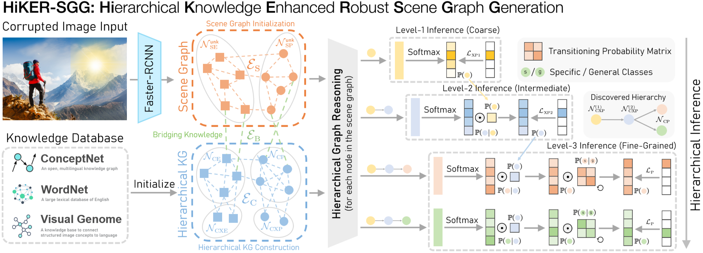

# [CVPR 2024] HiKER-SGG

[](https://arxiv.org/abs/2403.12033) [](https://opensource.org/licenses/MIT)

## 👀Introduction

This repository contains the code for our CVPR 2024 paper `HiKER-SGG: Hierarchical Knowledge Enhanced Robust Scene Graph Generation`. [[Paper](https://arxiv.org/abs/2403.12033)] [[Website](https://zhangce01.github.io/HiKER-SGG/)]



## 💡Environment

We test our codebase with PyTorch 1.12.0 with CUDA 11.6. Please install corresponding PyTorch and CUDA versions according to your computational resources.

Then install the rest of required packages by running `pip install -r requirements.txt`. This includes jupyter, as you need it to run the notebooks.

## ⏳Setup

We use the [Visual Genome](https://homes.cs.washington.edu/~ranjay/visualgenome/index.html) dataset in this work, which consists of 108,077 images, each annotated with objects and relations. Following [previous work](https://arxiv.org/pdf/1701.02426.pdf), we filter the dataset to use the most frequent 150 object classes and 50 predicate classes for experiments.

You can download the images here, then extract the two zip files and put all the images in a single folder:

Part I: https://cs.stanford.edu/people/rak248/VG_100K_2/images.zip

Part II: https://cs.stanford.edu/people/rak248/VG_100K_2/images2.zip

Then download VG metadata preprocessed by [IMP](https://arxiv.org/abs/1701.02426): [annotations](http://svl.stanford.edu/projects/scene-graph/dataset/VG-SGG.h5), [class info](http://svl.stanford.edu/projects/scene-graph/dataset/VG-SGG-dicts.json),and [image metadata](http://svl.stanford.edu/projects/scene-graph/VG/image_data.json) and copy those three files in a single folder.

Finally, update `config.py` to with a path to the aforementioned data, as well as the absolute path to this directory.

We also provide two pre-trained weights:

1. The pre-trained Faster-RCNN checkpoint trained by [MotifNet](https://arxiv.org/pdf/1711.06640.pdf) from https://www.dropbox.com/s/cfyqhskypu7tp0q/vg-24.tar?dl=0 and place in `checkpoints/vgdet/vg-24`.

2. The pre-trained GB-Net checkpoint ``vgrel-11`` from https://github.com/alirezazareian/gbnet and place in `checkpoints/vgdet/vgrel-11`.

If you want to train from scratch, you can pre-train the model using Faster-RCNN checkpoint. However, we recommend to train from the GB-Net checkpoint.

## 📦Usage

You can simply follow the instructions in the notebooks to run HiKER-SGG experiments:

1. For the PredCls task: ``train: ipynb/train_predcls/hikersgg_predcls_train.ipynb``, ``evaluate: ipynb/eval_predcls/hikersgg_predcls_test.ipynb``.
2. For the SGCls task: ``train: ipynb/train_sgcls/hikersgg_sgcls_train.ipynb``, ``evaluate: ipynb/eval_sgcls/hikersgg_sgcls_train.ipynb``.

Note that for the PredCls task, we start training from the GB-Net checkpoint; and for the SGCls task, we start training from the best PredCls checkpoint.

## 📈VG-C Benchmark

In our paper, we introduce a new synthetic VG-C benchmark for SGG, containing 20 challenging image corruptions, including simple transformations and severe weather conditions.


We include the code for generating these 20 corruptions in ``dataloaders/corruptions.py``. To use it, you also need to modify the codes in ``dataloaders/visual_genome.py``, and also enable ``-test_n`` in the evaluation notebook file.

## 🙏Acknowledgements

Our codebase is adapted from [GB-Net](https://github.com/alirezazareian/gbnet) and [EB-Net](https://github.com/zhanwenchen/eoa). We thank the authors for releasing their code!

## 📧Contact

If you have any questions, please  contact at [cezhang@cs.cmu.edu](mailto:cezhang@cs.cmu.edu).

## 📌 BibTeX & Citation

If you find this code useful, please consider citing our work:

```bibtex
@inproceedings{zhang2024hikersgg,
  title={HiKER-SGG: Hierarchical Knowledge Enhanced Robust Scene Graph Generation},
  author={Zhang, Ce and Stepputtis, Simon and Campbell, Joseph and Sycara, Katia and Xie, Yaqi},
  booktitle={IEEE/CVF Conference on Computer Vision and Pattern Recognition},
  year={2024}
}
```

