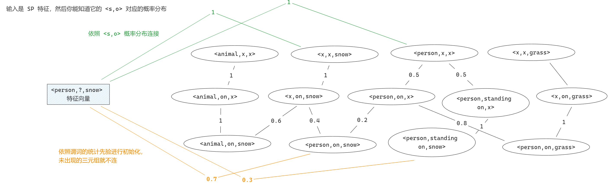

我想在这个模型中添加个与 @ggnn.py 并列的分支模块，目的是基于细粒度的三元组特征来分类谓词，比如把 `<person, standing on, snow>` 视作单独的类，并且视作 `<person, standing on, X>` 和 `<X, standing on, snow>` 的子类，同时还需要添加额外的细粒度三元组分类损失。我把这个分支模块叫做 FCG Net，全称是 Finegrained Commonsense Graph Net。其中 FCG 如下面的示意图所示，是个三级的知识图结构。

# 需要考虑
1. 如何计算全局概率？
    全局概率的计算使用层级分类来计算，其中第一级分类按照 `<s,o>` 的概率分布进行，后两级分类对两分支下特征比较相似度。因为在顶层有两个出发点，因此需要对两条分支的概率进行合并。
2. 如何处理未出现在训练集中的关系对？
    对于训练集中不存在的关系对 `<s,?,o>`，由 `<s,p1,x>` `<x,p1,o>` 的重叠谓词 `p1` 连缀成虚节点 `<s,p1,o>`，如果不存在这样的虚节点，则判定 `<s,o>` 之间没有关系。
3. 虚节点与二级节点的权重边如何连接？
    我参考的是指数回退的思想。我给个具体的例子吧，假如有虚节点 `<person, on, snow>` `<person, on, grass>` 和最小权重的三级节点 `<person, on, desk>`；如果 `<person, on, desk>` 根据样本频率算出来的统计先验概率是 0.2，那么我就让两个虚拟节点共分 1/2 * 0.2 = 0.1 的概率，最后再做个 Softmax 将概率总和归一化到 1
4. 是否要更新 FCG 图中的边权重？以什么规则更新？
    先不更新。
5. 是否要设定不同类型的边，比如二三级节点之间的边是一种，然后虚节点与二级节点之间的边是一种？ 是否要设定同级边？
    先采用一种边类型，不考虑同级边。同级边的引入会让 FCG 变得过于稠密，大大增大计算开销。

# 代码实现步骤
统一规则，均采用中文注释，新创建的文件均放在 /model/feature 包下。建议将构建和前向传播分别放到新建的 fcg_builder.py 文件和 fcg_net.py 文件中。

## FCG_Builder
### 节点构建与边连接
读取 @config.py 的 EDGE_MATRIX 文件，里面以 151x151x51 的张量记录着训练集中所有关系的统计先验；读取 @config.py 的 NODE_EMBEDDING 文件，里面记录着实体(entity)标签与谓词(predicate)标签的词嵌入向量。

先构建三级节点，三级节点的初始化特征由 <s,p,o> 的词嵌入向量 concat 后过 emb_fc 得到。然后构建二级节点，其初始化特征为子类三级节点的平均。然后构建一级节点，其初始化特征为子类二级节点的平均。最后构建虚节点【虚节点在层级上与三级节点并列】，其初始化特征为二级节点的平均。

构建节点时，将节点索引号，`<s,p,o>` 对应的实际含义比如 `<person, standing on, snow>`，样本数量【虚节点样本数量为 0，一二级节点样本数量为其下属三级节点样本数量的和，三级节点的样本数量等于训练集中该三元组的标注数量】，等信息全部写到 Json 文件中，便于后面的查阅和检查。

## FCG_Net
### 前向传播参数
输入参数：输入参数均为来自同一张图片中的样本，
    - rel_inds：shape(img_all_rels,2) 候选的 <s,o> 二元组
    - obj_probs：shape(img_gt_boxes,151) Boxes 的特征图
    - vr：shape(img_all_rels,1024) 关系的视觉特征
返回值：
    - pred_cls_score：谓词的预测概率 
    - scpred_cls_score：超类谓词的预测概率

FCG Net 的输入参数参见 @ggnn.py 中的 forward 方法的 rel_inds, obj_probs, vr 参数，它们都是属于同一张样本的数据。
返回值参见 @ggnn.py 中的 forward 方法的 pred_cls_score, scpred_cls_score 参数。
### 桥边建立 
0. 建立 l1_nodes_xxx_idx_map 下标映射，目的为将数据集中的下标映射到 fcg_l1_nodes 列表中的下标
1. 根据 rel_inds 找到某个关系对应的 gt_boxes
2. 根据 obj_probs 找到某个 gt_boxes 对应的在 151 种实体上概率分布
3. 使用上面的 xxx_mask 剔除没有在 l1_nodes 上出现的实体的概率，然后将概率归一化
4. 这样一趟下来，所有边的权重加起来会为 2，将其归一化

### 信息传递
如同 @ggnn.py 那样，先计算接收到的信息，然后仿照 @ggnn.py 中的流程进行基于 GRU 规则的特征更新，传递次数为三次。每次更新仅更新节点的特征表示，而不更新边连接权重。不进行三级节点的初始连接，仅初始连接一级节点，因为如果分别在一级和三级节点对三元组进行连接，会导致在信息传递时，第二级的节点会接收到两次特征信息，有冗余可能不好。

### 层级分类
仿照 @hier.py 中的 hierarchical_pred_reasoning 方法来进行层级分类

### 损失与反向传播
损失函数的设计参考 @hiker_model.py 中的 rel_loss 方法
